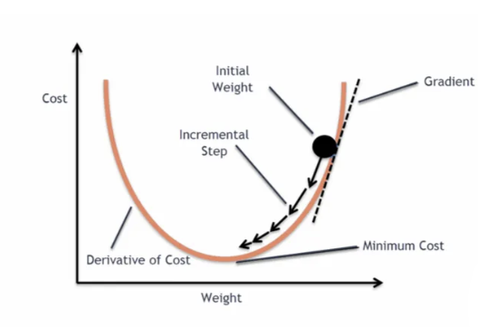

# Gradient Descent

## 목차
- [1. Gradient Descent란?](#1-gradient-descent란)
  - [수학적 근거 (Taylor Approximation)](#수학적-근거-taylor-approximation)
- [2. Learning Rate (학습률)](#2-learning-rate-학습률)
  - [역할](#역할)
  - [문제점](#문제점) 
  - [개선 방법](#개선-방법)
- [3. Weight Initialization](#3-weight-initialization)
- [4. Variants of Gradient Descent](#4-variants-of-gradient-descent)
- [5. 단점](#5-단점)
  - [Local Minimum](#local-minimum)
  - [Saddle Point](#saddle-point) 
  - [Plateau / Flat Region](#plateau--flat-region)
- [6. 해결 전략](#6-해결-전략)

## 1. Gradient Descent란?

- 고차원 공간에서 손실 함수 𝐿(𝜃)를 최소화하는 파라미터 𝜃를 찾는 최적화 기법
- 손실 함수의 기울기를 이용해, 손실을 가장 빠르게 줄일 수 있는 방향을 계산하고, 그 반대 방향으로 조금씩 이동하며 학습을 진행
- Gradient는 손실 함수가 가장 빠르게 증가하는 방향을 알려주기 때문에, 그 반대 방향으로 나아가면 손실을 효과적으로 줄일 수 있음

### 수학적 근거 (Taylor Approximation)

$L(\theta + \Delta\theta) \approx L(\theta) + \nabla_\theta L(\theta)^T \Delta\theta$

- 만약 $\Delta\theta = -\eta \cdot \nabla_\theta L(\theta)$ 로 설정하면, $L$이 줄어듬

---

## 2. Learning Rate (학습률)

### 역할
- Learning rate $\eta$는 한 번 이동할 때 얼만큼 움직일지를 조절함

### 문제점
- 너무 크면 : overshooting → 발산하거나 global min 지나침
- 너무 작으면 : 느린 수렴, local minima/saddle point에 갇힘

### 개선 방법
- **Learning Rate Decay**: epoch 진행에 따라 감소
- **Warmup + Decay**: 초반에는 천천히 증가 후 감소
- **Adaptive Methods**:
  - **Adam**: 평균 + 분산 고려
  - **RMSProp**, **AdaGrad**: 파라미터별로 다른 학습률

---

## 3. Weight Initialization

- 초기값에 따라 gradient가 소실되거나 폭발할 수 있음

### 초기화 전략

- 랜덤하게 0 근처로 잡음

| 초기화 방식 | 수식                                                                                                                  | 주로 쓰는 활성화 함수 |
|-------------|------------------------------------------------------------------------------------------------------------------------|------------------------|
| LeCun       | Normal: $\mathcal{N}(0, \frac{1}{n_{in}})$,  Uniform: $\mathcal{U}(-\sqrt{\frac{3}{n_{in}}}, \sqrt{\frac{3}{n_{in}}})$ | Sigmoid                |
| Xavier      | Normal: $\mathcal{N}(0, \frac{2}{n_{in} + n_{out}})$,  Uniform: $\mathcal{U}(-\sqrt{\frac{6}{n_{in} + n_{out}}}, \sqrt{\frac{6}{n_{in} + n_{out}}})$ | Tanh                   |
| He          | Normal: $\mathcal{N}(0, \frac{2}{n_{in}})$,  Uniform: $\mathcal{U}(-\sqrt{\frac{6}{n_{in}}}, \sqrt{\frac{6}{n_{in}}})$ | ReLU 계열              |

---

## 4. Variants of Gradient Descent

| 방법                       | 특징                          |
|----------------------------|-------------------------------|
| **Batch Gradient Descent** | 전체 데이터 기준 → 느림, 안정적 |
| **Stochastic Gradient Descent (SGD)** | 샘플 1개 기준 → 빠름, 노이즈 있음 |
| **Mini-Batch Gradient Descent** | N개씩 묶음 → 속도-안정성 균형 |

---

## 5. 단점

### Local Minimum
- 전체 최솟값이 아닌, 지역 최솟값에 갇히는 현상

### Saddle Point
- Gradient가 0이지만 최솟값은 아님
- 고차원 공간에서는 더 흔함

### Plateau / Flat Region
- 기울기 거의 0 → **학습 정체**

---

## 6. 해결 전략

| 문제                 | 해결 기법                                 |
|----------------------|-------------------------------------------|
| Local Min / Saddle   | Momentum, Nesterov, Adam                  |
| Vanishing Gradient   | ReLU, BatchNorm, He Initialization       |
| Overshooting         | Learning Rate Decay, Gradient Clipping    |
| 느린 수렴            | Adaptive Optimizer, Learning Rate Warm-up |

---