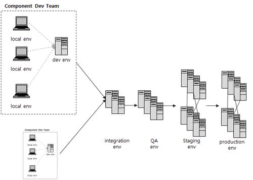

# 서버 환경 분리 및 관리

## 목차

1. [서버 환경의 종류](#서버-환경의-종류)
   - [Local Server (로컬 서버)](#local-server-로컬-서버)
   - [Development Server (개발 서버)](#development-server-개발-서버)
   - [Integration Server (통합 서버)](#integration-server-통합-서버)
   - [QA Server (품질 보증 서버)](#qa-server-품질-보증-서버)
   - [Staging Server (스테이징 서버)](#staging-server-스테이징-서버)
   - [Production Server (운영 서버)](#production-server-운영-서버)
2. [개발 환경 분리의 필요성](#개발-환경-분리의-필요성)
3. [장애 대응 프로세스](#장애-대응-프로세스)

## 서버 환경의 종류

### Local Server (로컬 서버)

- 개발자가 본인의 PC에서 개발하는 환경
- 요즘은 보통 각 개발자가 Git에서 master/dev 브랜치를 clone하여 개발
- 개발도구나 라이브러리에 대한 통합 관리 필요
- local에서 잘 수행되던 코드가 dev 환경에서 동작하지 않을 수 있음
- 프로젝트 내 라이브러리의 dependency를 관리해주는 도구 활용 권장

### Development Server (개발 서버)

- 개발자들이 각자 개발한 내용들을 합친 뒤 테스트하는 환경
- 개발 프로세스:
    - Local에서 개발자들이 코드 개발 및 간단한 unit test 수행
    - Pull request를 통해 dev 브랜치로 merge
    - CI/CD가 구성된 프로젝트라면 dev 브랜치로 merge 시 자동 배포
- 주로 기능 테스트가 이루어짐
- 리소스는 구동 가능한 최소한으로 구성 (성능 테스트는 이후 환경에서 진행)

### Integration Server (통합 서버)

- 여러 컴포넌트를 동시 개발하고 각 컴포넌트 간 의존성이 있을 때 통합 및 테스트하는 환경
- Dev 환경에서 코드가 정상 동작한다면 통합 개발 환경에서 테스트 진행
- Dev 환경과 마찬가지로 기능 테스트를 위한 최소한의 리소스로 구성

### QA Server (품질 보증 서버)

- QA(Quality Assurance)를 위한 전용 환경
- 테스터가 기능/비기능에 대한 테스트 수행
- 이슈 발견 시 개발자에게 전달되고, 개발자는 local 환경에서 수정 작업 시작

### Staging Server (스테이징 서버)

- 운영 환경과 거의 동일하게 구성된 환경으로, 릴리즈 전 최종 테스트
- 일반적으로 release 브랜치를 테스트
- 운영 환경 이전 전 비기능적 부분(보안, 성능, 장애 등) 검증
- 실제 트래픽을 미러링하여 테스트하기도 함

### Production Server (운영 서버)

- 실제 서비스를 위한 운영 환경
- 릴리즈 버전의 코드가 실행되며 실제 사용자가 이용하는 환경
- 릴리즈 계획 없이는 수정 불가
- 협의되지 않은 hotfix나 임의 배포는 서비스에 큰 악영향 초래
- 릴리즈 브랜치로 배포 후, 정상 배포 확인 시 master(main) 브랜치로 merge

## 개발 환경 분리의 필요성

운영 서버와 개발 서버를 분리하는 이유:

- 서비스 안정성 보장
- 개발 및 테스트 과정에서 발생할 수 있는 오류로부터 실제 서비스 보호
- 신규 기능 및 변경사항을 실제 서비스에 적용하기 전 검증 가능
- 운영 환경에 영향을 주지 않고 개발 및 테스트 활동 수행 가능

## 장애 대응 프로세스

### 기본 프로세스 흐름

운영 서버에서 장애 발생 → 개발 서버에서 수정 → 스테이징 서버에서 검증 → 운영 서버로 배포

### 세부 프로세스

1. **장애 발생 (운영 서버)**
    
    - 운영 서버에서 장애 발생 (예: 특정 기능 작동 불가, 성능 저하 등)
2. **장애 원인 파악**
    
    - 로그, 모니터링 시스템 (예: Prometheus, Grafana) 등을 활용해 원인 파악
3. **수정 및 테스트 (개발 서버)**
    
    - 개발 서버에서 코드 수정
    - 단위 테스트 및 통합 테스트 진행
4. **배포 전 최종 검증 (스테이징 서버)**
    
    - 스테이징 서버에서 최종 테스트
    - 운영 환경과 동일한 설정으로 기능 검증 및 성능 테스트
5. **배포 (운영 서버)**
    
    - 운영 서버로 수정된 코드 배포
    - CI/CD 파이프라인을 통한 자동화 배포
    - 배포 후 모니터링을 통해 정상 동작 확인