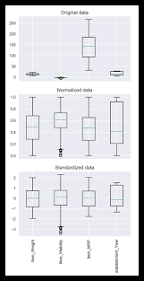

# 피처 스케일링 비교: 정규화(Normalization) vs 표준화(Standardization)

## 목차
- [1. 피처 스케일링이 필요한 이유](#1-피처-스케일링이-필요한-이유)
- [2. 알고리즘 민감도 비교](#2-알고리즘-민감도-비교)
- [3. 정규화 vs 표준화](#3-정규화-vs-표준화)
- [4. 장단점 비교](#4-장단점-비교)
  - [정규화의 장점](#정규화의-장점)
  - [정규화의 단점](#정규화의-장점)
  - [표준화의 장점](#표준화의-장점)
  - [표준화의 단점](#표준준화의-장점)
- [5. 실무 적용 팁](#5-실무-적용-팁)
- [6. 언제 어떤 방식을 선택할까?](#6-언제-어떤-방식을-선택할까?)

## 1. 피처 스케일링이 필요한 이유

- 일부 머신러닝 알고리즘은 feature의 scale에 따라 모델 성능에 큰 차이가 발생
- 피처 간 단위 차이가 클 경우, 학습 속도와 정확도 저하  
- 공정한 학습을 위해 모든 피처의 범위를 비슷하게 맞출 필요가 있음  

## 2. 알고리즘 민감도 비교

| 알고리즘 분류       | 스케일 민감도 | 예시                                       |
|--------------------|----------------|--------------------------------------------|
| 경사 하강법(Gradient Descent) 기반 | 높음     | 선형 회귀, 로지스틱 회귀, 신경망 등 |
| 거리 기반 (Distance-based) 알고리즘 | 높음      | KNN, SVM, K-평균 등  
| 트리 기반 (Tree-based) 알고리즘 | 낮음        | 결정 트리, 랜덤 포레스트, XGBoost 등  

## 3. 정규화 vs 표준화  

| 항목       | 정규화   (Normalization)                          | 표준화(Standardization)                          |
|------------|------------------------------------|----------------------------------|
| 수식       | (값 - 최소) / (최대 - 최소)         | (값 - 평균) / 표준편차             |
| 값 범위    | 0 ~ 1                              | 평균 0, 표준편차 1                |
| 분포 가정  | 필요 없음                           | 정규 분포일수록 효과적             |
| 이상치 영향| 민감함                              | 상대적으로 덜 민감함              |
| 활용 예시  | KNN, 신경망 등                       | 회귀, PCA, 선형 모델 등           |

## 4. 장단점 비교

### 정규화의 장점  
- 모든 값이 0~1 범위로 변환되어 직관적임  
- 거리 기반 모델이나 신경망에 적합  
- 데이터 분포에 대한 가정 없이 사용 가능  

### 정규화의 단점  
- 이상치에 매우 민감  
- 새로운 데이터가 기존 범위를 벗어나면 재스케일링 필요  

---

### 표준화의 장점  
- 평균 기준으로 정규화되어 안정적인 분포 생성  
- 대부분의 알고리즘에서 기본적으로 잘 작동  
- 이상치에 비교적 덜 민감  

### 표준화의 단점  
- 결과값의 범위가 직관적이지 않음  
- 데이터가 정규 분포에서 벗어나면 효과가 감소할 수 있음  

## 5. 실무 적용 팁

- 학습 데이터에는 `fit_transform()`, 테스트 데이터에는 `transform()`만 사용 (데이터 누수 방지)  
- 로그 변환이 필요하다면 스케일링 전에 적용  
- 이상치가 많다면 `RobustScaler` 같은 대안 고려  
- Pipeline을 사용하여 전처리 순서 명확히 관리  
- 트리 기반 모델 제외한 대부분의 모델에서는 반드시 스케일링 고려  

## 6. 언제 어떤 방식을 선택할까?

| 상황                                 | 추천 방식   | 이유                                |
|--------------------------------------|--------------|-------------------------------------|
| 분포가 일정하지 않고 신경망 사용하는 경우 | 정규화       | 단순 범위 정규화가 효과적            |
| 데이터가 정규 분포에 가까운 경우      | 표준화       | 평균-표준편차 기준이 안정적으로 작동 |
| 이상치가 많은 경우                   | 표준화       | 이상치에 민감하지 않음               |
| 거리 기반 알고리즘을 사용하는 경우     | 정규화       | 거리 계산 정확도를 높이기 위함       |
| PCA, 회귀 등 수학적 계산이 많은 경우 | 표준화       | 수학적 안정성 확보 가능              |

