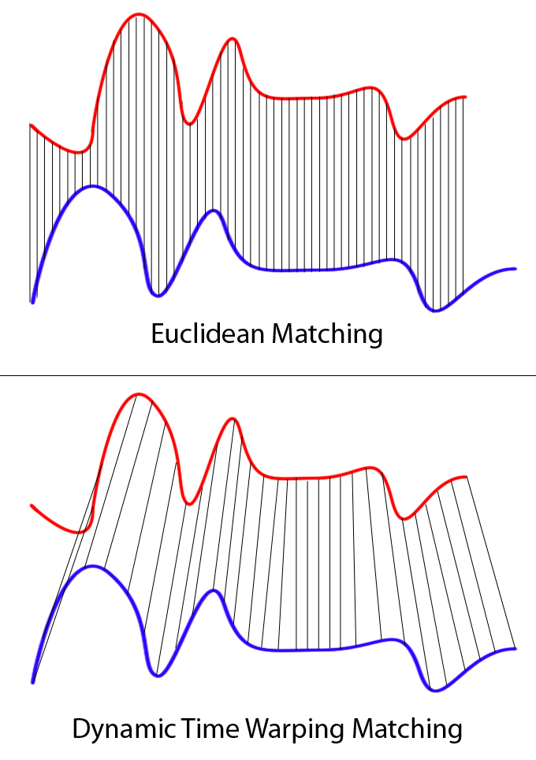

# DTW(Dynamic Time Warping)

## 목차
- [1. DTW란?](#1-dtw란)
- [2. 작동 원리 및 수식](#2-작동-원리-및-수식)
- [3. 시간복잡도 및 최적화 기법](#3-시간복잡도-및-최적화-기법)
- [4. Euclidean Distance와 비교](#4-euclidean-distance와-비교)
- [5. 확장 알고리즘 및 변형](#5-확장-알고리즘-및-변형)
- [6. DTW의 장단점](#6-dtw의-장단점)
  - [DTW의 장점](#dtw의-장점)
  - [DTW의 단점](#dtw의-단점)
- [7. 실무 적용 팁](#7-실무-적용-팁)
- [8. 언제 DTW를 사용할까?](#8-언제-dtw를-사용할까)
  - [권장](#권장)
  - [조건부 권장](#조건부-권장) 
  - [비권장](#비권장)

## 1. DTW란?
- DTW(Dynamic Time Warping)는 두 시계열 간의 유사도를 측정하기 위한 알고리즘
- 서로 다른 길이의 시계열 간 시간 왜곡(warping)을 허용
- 동일한 패턴이라도 속도가 다를 수 있는 시계열에 효과적
- 음성 인식, 제스처 인식, 이상 탐지 등 다양한 분야에서 활용

## 2. 작동 원리 및 수식
- 두 시계열 A=[a₁,...,aₙ], B=[b₁,...,bₘ]
- n×m 누적 거리 행렬 생성
- 최단 누적 비용 경로는 동적계획법으로 계산됨
- 수식:
  - 초기 조건: DTW[0,0] = 0, DTW[i,0] = ∞, DTW[0,j] = ∞ (i>0, j>0)
  - 반복 계산: DTW[i,j] = dist(aᵢ, bⱼ) + min(DTW[i-1,j], DTW[i,j-1], DTW[i-1,j-1])
- 거리 함수 dist()는 유클리드 거리가 일반적이나 맨해튼, 코사인 등 다양한 거리 측정 가능
- 경로 선택 방식: →, ↓, ↘ 이동 가능
- 최적 경로는 (0,0) → (n,m)까지 backtracking으로 추적

## 3. 시간복잡도 및 최적화 기법

| 알고리즘                  | 시간복잡도      | 설명                    |
| --------------------- | ---------- | --------------------- |
| 기본 DTW                | O(N²)      | 모든 시점 비교 필요           |
| Sakoe-Chiba Band      | O(N·r)     | 대각선 주변 r 너비 내에서만 계산   |
| Itakura Parallelogram | O(N·r)     | 평행사변형 영역 내에서만 계산      |
| LB_Keogh              | O(N)       | 하한 경계 기법으로 불필요한 계산 제거 |
| FastDTW               | O(N·log N) | 다해상도 접근법, 근사치 계산      |

## 4. Euclidean Distance와 비교

| 항목 | Euclidean Distance | DTW (Dynamic Time Warping) |
|------|-------------------|----------------------------|
| 비교 방식 | 시간축 고정 1:1 | 시간축 왜곡 허용 |
| 계산 복잡도 | O(N) | O(N²) (기본), O(N·log N) (최적화) |
| 유사도 반영 | 속도 차이 반영 불가 | 속도 차이 반영 가능 |
| 분류 성능 | 시간 왜곡이 있는 데이터에서 성능 저하 | 시간 왜곡이 있는 데이터에서 성능 우수 |
| 활용 예 | 고정된 패턴 시계열 | 유동적인 행동 패턴 시계열 |

## 5. 확장 알고리즘 및 변형

| 알고리즘 | 설명 |
|---------|------|
| **Soft-DTW** | 미분 가능한 DTW 변형, 소프트 최소값 사용, 딥러닝과 연계 가능 |
| **Multivariate DTW** | 다변량 시계열 지원, 각 차원별 가중치 설정 가능 |
| **Subsequence DTW** | 긴 시계열 내에서 패턴 검색, 실시간 스트리밍 데이터 처리 |
| **DTW Barycenter Averaging** | 여러 시계열의 평균 프로토타입 계산 |
| **Weighted DTW** | 시간 왜곡 정도에 따라 가중치 부여 |
| **Derivative DTW** | 원시 값 대신 미분 값 사용, 트렌드 변화에 더 민감 |

## 6. DTW의 장단점

### DTW의 장점
- 시간 왜곡을 고려한 유연한 비교 가능
- 패턴이 유사하지만 시간적 간격이 다른 경우에도 잘 작동
- 다양한 길이의 시계열 비교 가능
- DBSCAN 등 군집 알고리즘과 결합 시 유의미한 결과 도출

### DTW의 단점
- 계산 비용이 높음 (최적화 없이 O(N²))
- 메모리 사용량이 큼 (n×m 행렬 필요)
- Sparse한 시계열에서는 잘못된 alignment 발생 가능
- 병리적 정렬(pathological warping) 문제 - 과도한 warping 가능성
- 비교 기준(reference) 시계열이 필요
- 최적화 없이는 실시간 적용에 부적합

## 7. 실무 적용 팁
- 시계열 간 패턴 비교, 분류, 이상 탐지 등에 효과적
- 데이터가 sparse하거나 이벤트 중심일 경우 보간(interpolation) 또는 smoothing 사전 적용
- FastDTW + 병렬처리로 연산 병목 제거 가능
- LB_Keogh와 같은 하한 경계 기법으로 불필요한 DTW 계산 회피
- 대표 패턴을 저장해 sliding window 구조로 온라인 스트리밍 데이터 대응 가능
- 라이브러리 활용:
  - Python: tslearn, fastdtw, scipy
  - R: dtw 패키지
  - Java: JavaML, timeseriesweka
  - 성능 중심: dtaidistance(CPU 최적화), cuTWED(GPU 기반)

## 8. 언제 DTW를 사용할까?

### 권장

|상황|이유|
|---|---|
|유사한 패턴이나 속도만 다른 시계열|warping을 통해 시간 축 왜곡을 정렬 가능|
|대규모 사용자 시계열 비교|FastDTW 및 병렬처리를 통한 근사 계산으로 확장성 확보|
|시계열 군집화|거리 기반 유사도 측정에 적합, DBSCAN 등과 결합 유리|
|트렌드 분석|Derivative DTW를 사용해 변화율 중심 비교 가능|

---

### 조건부 권장

|상황|이유|
|---|---|
|실시간 anomaly detection|LB_Keogh 등의 하한 경계 및 캐싱, window 제한으로 속도 보완 가능|
|고차원 다변량 시계열|차원별 가중치 조정 및 multivariate DTW 기법 필요|

---

### 비권장

|상황|이유|
|---|---|
|매우 짧고 불연속적인 이벤트 시계열|시계열적 연속성 부족으로 alignment 자체가 무의미하거나 왜곡될 수 있음|
|실시간 응답성이 중요한 시스템에서 기본 DTW 사용|연산 비용이 커서 latency 발생, 별도 최적화 없이는 부적합|