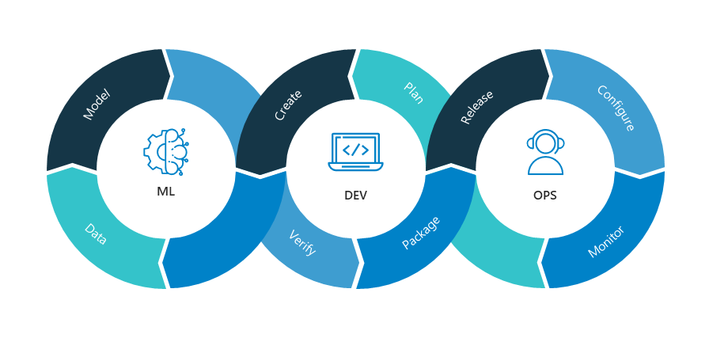
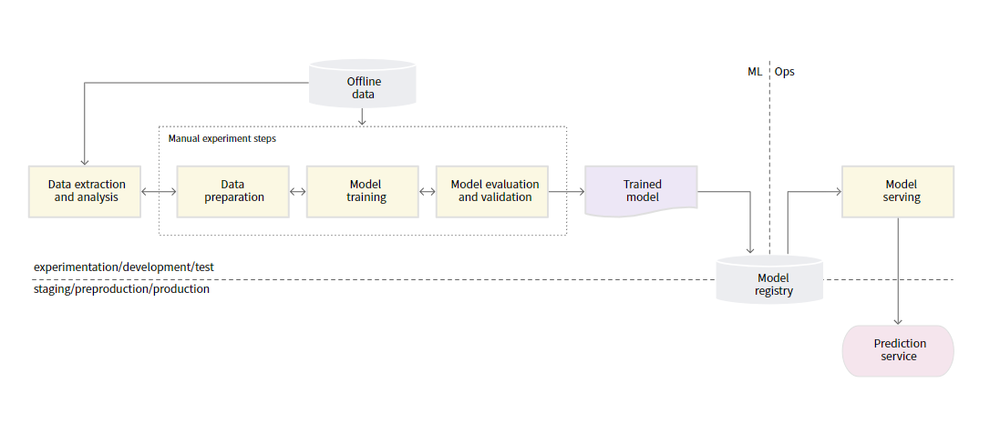
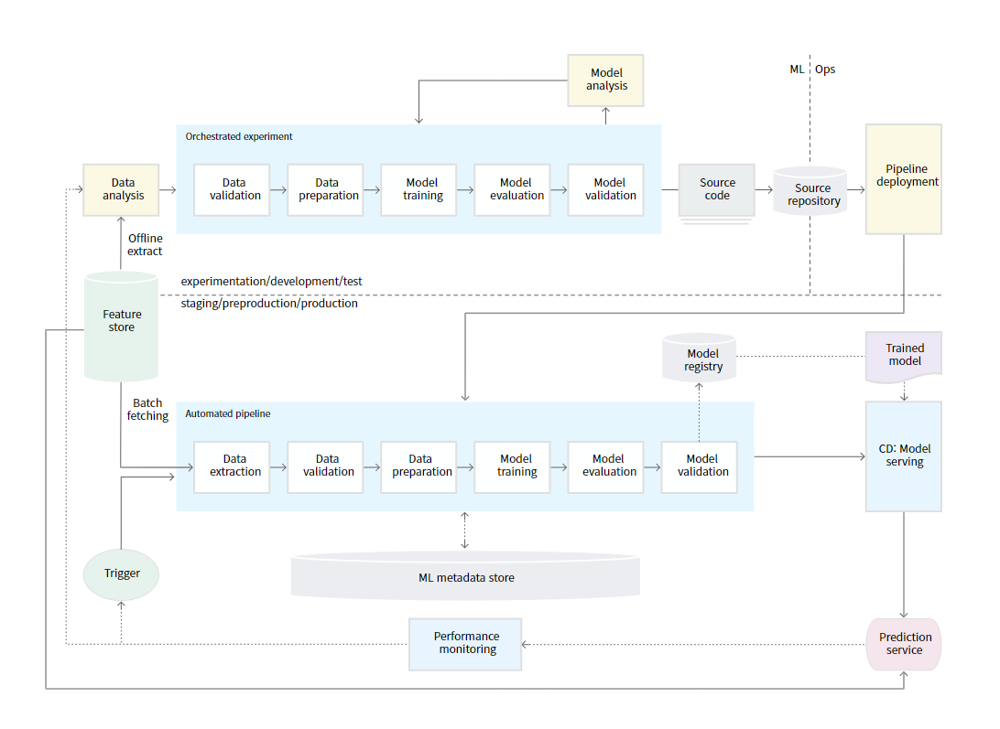
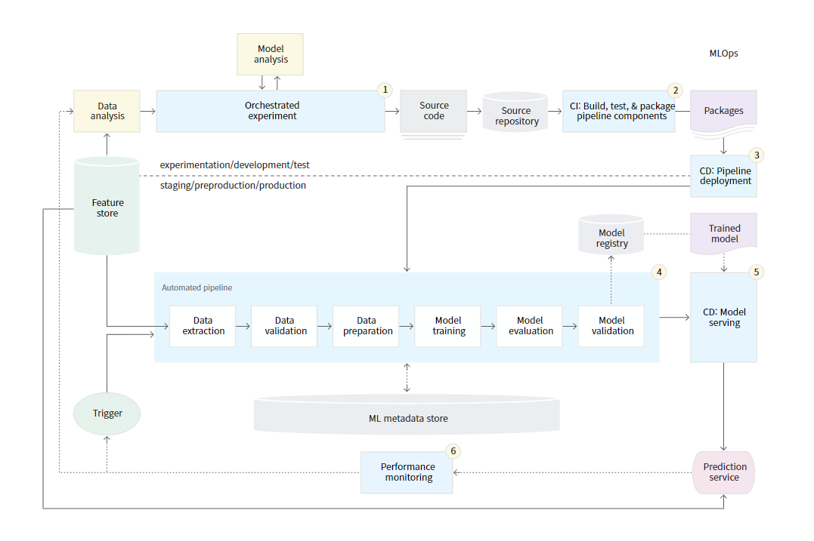

# MLOps: 개요

## 목차
- [1. MLOps의 탄생배경](#1-mlops의-탄생배경)
- [2. MLOps 개요](#2-mlops-개요)
  - [정의와 목적](#정의와-목적)
  - [구성 요소](#구성-요소)
- [3. MLOps의 필요성](#3-mlops의-필요성)
  - [효율성 증진](#효율성-증진)
  - [긴밀한 협업](#긴밀한-협업)
  - [확장성](#확장성)
  - [안정성](#안정성)
- [4. MLOps 단계별 자동화 수준](#4-mlops-단계별-자동화-수준)
  - [Level 0: Manual Process](#level-0-manual-process)
  - [Level 1: ML pipeline automation](#level-1-ml-pipeline-automation)
  - [Level 2: CI/CD pipeline automation](#level-2-cicd-pipeline-automation)

## 1. MLOps의 탄생배경

### ML 연구와 서비스 간 괴리
- 기업들은 ML 모델을 서비스화하는 과정에서 많은 어려움을 겪음
- 개발된 ML 모델의 약 80%가 서비스화에 실패하고 버려짐

### 관점 변화
- ML 모델 자체보다 주변 환경과 프로세스의 중요성 부각
  - 데이터 품질 및 정제 과정
  - 모델의 효율적인 서비스 통합
  - 배포 후 지속적인 성능 모니터링

### MLOps 개념 등장
- 모델 개발(연구) 외에 운영(Operations) 업무 비중 증가
- 머신러닝 모델의 개발부터 배포, 유지관리까지 전체 생애주기를 관리하는 MLOps 패러다임 출현

## 2. MLOps 개요

### 정의와 목적

**정의:**

Machine Learning과 Operations를 결합한 용어로, ML 시스템 개발과 운영을 통합하는 엔지니어링 문화 및 방법론

**목적:**
- 연구 위주의 머신러닝 모델을 안정적이고 효율적으로 배포 및 유지 관리
- 머신러닝 시스템을 위한 CI/CD(지속적 통합, 지속적 배포) 구현
- 지속적 학습을 통한 모델 성능 유지 및 향상
- 머신러닝 개발 및 운영 프로세스의 자동화

### 구성 요소

MLOps는 크게 ML(개발) 단계와 Ops(운영) 단계로 구분

**ML 단계:**
- 데이터 수집
- 데이터 전처리
- 모델 구축
- 모델 학습
- 모델 평가

**Ops 단계:**
- 모델 배포
- 모니터링
- 테스트 및 검증

## 3. MLOps의 필요성

### 효율성 증진

**모델 개발 시:**
- **Feature Selection 자동화**: 다양한 데이터셋을 효율적으로 관리
- **알고리즘 테스트 자동화**: 다양한 머신러닝 알고리즘과 대량의 파라미터를 한 번에 학습
- **하이퍼파라미터 튜닝**: 수동 최적화 대비 시간 단축 및 성능 향상

**모델 운영 시:**
- **자동 업데이트**: 새로운 데이터 기반으로 모델 자동 업데이트
- **리소스 효율화**: 자동화를 통한 인력 및 시간 절감

### 긴밀한 협업

- 데이터 사이언티스트, 개발자, 운영팀 간 원활한 협업 환경 제공
- 개발 환경 구성의 자동화로 팀 간 의존성 감소
- 실시간 공동 작업과 반복 데이터 탐색 기능 지원
- 실험 추적, 모델 관리, 피처 엔지니어링 간소화
- 릴리즈 속도 향상

### 확장성

- 다수의 모델 동시 관리 및 배포 가능
- 다양한 업데이트 주기에 대응
- 대량의 모델을 자동으로 관리, 감독, 제어, 모니터링
- 모델 통합 및 배포 프로세스 간소화

### 안정성

- 지속적 통합, 배포, 학습을 통한 데이터 품질 유지
- ML 시스템의 자동 관리로 인적 오류 감소
- 안정적인 서비스 운영 보장

## 4. MLOps 단계별 자동화 수준

구글에서는 MLOps의 자동화 수준을 세 단계로 구분

### Level 0: Manual Process
데이터 분석, 데이터 준비, 모델 학습, 모델 검증을 포함한 모든 단계를 수동으로 수행하는 단계

**특징:**
- 모델 최적화와 선택을 수동으로 진행
- 업데이트 주기가 길거나 관리 모델이 적은 경우 적합
- CI/CD를 고려하지 않음
- 모델 최적화를 위한 기본적인 모니터링 수행

### Level 1: ML pipeline automation
ML 파이프라인 자동화를 통해 모델을 지속적으로 학습하고 모델 예측 서비스를 지속적으로 수행할 수 있는 단계

**특징:**
- 새로운 데이터를 기반으로 모델이 프로덕션 환경에서 자동 학습
- 새로 학습된 모델에 예측 서비스를 지속적으로 배포
- 자동 반복 실행되는 전체 학습 파이프라인 배포
- 실시간 파이프라인 트리거 기반 운영

### Level 2: CI/CD pipeline automation
프로덕션 단계에서 파이프라인을 빠르고 안정적으로 업데이트 하기 위한 강력하고 자동화 된 CI/CD 시스템을 구축하는 단계

**특징:**
- 특성 추출, 모델 아키텍처, 하이퍼파라미터에 대한 실험 자동화
- CI: 소스 코드 빌드 및 파이프라인 구성요소 테스트 자동화
- CD: CI 단계 아티팩트를 대상 환경에 자동 배포
- 일정 또는 트리거에 따라 프로덕션 환경에서 파이프라인 자동 실행
- 가장 높은 수준의 자동화 구현