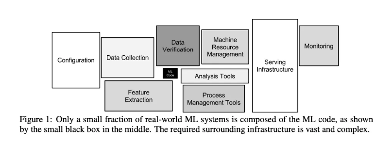

# MLOps: 실전 도입 전략

## 목차

- [1. 머신러닝 프로젝트의 기술 부채 문제](#1-머신러닝-프로젝트의-기술-부채-문제)
  - [기술 부채 (Technical Debt)](#기술-부채-technical-debt)

- [2. MLOps 도입 구성 방안](#2-mlops-도입-구성-방안)
  - [구성 방식 선택](#구성-방식-선택)
  - [주요 참여자 및 역할](#주요-참여자-및-역할)  
  - [환경 전반에서 통합 관리](#환경-전반에서-통합-관리)
  - [인력 운영 전략](#인력-운영-전략)

- [3. ML 엔지니어 역할 진화](#3-ml-엔지니어-역할-진화)

- [4. 생성형 AI 시대의 확장 : LLMOps / FMOps 확장](#4-생성형-ai-시대의-확장--llmops--fmops-확장)

- [5. 성공적인 MLOps 도입을 위한 핵심 원칙](#5-성공적인-mlops-도입을-위한-핵심-원칙)

## 1. 머신러닝 프로젝트의 기술 부채 문제

### 기술 부채 (Technical Debt)

머신러닝 프로젝트는 초기에는 빠르게 구축되고 시연할 수 있지만, 반복 개발과 운영 과정에서 점차 누적되는 기술 부채는 장기적으로 심각한 리스크로 작용

| 항목 | 설명 |
|------|------|
| **Data Validation 누락** | 데이터 누락/이상치/스키마 변경에 대한 자동 검증 체계 부족 → 모델 성능 저하 위험 |
| **Monitoring 미비** | 배포 이후 모델의 추론 정확도, 입력 데이터 분포 변화 등을 추적하지 않아 이상 탐지 실패 |
| **리소스 및 환경 관리 부족** | 실험 환경, 하이퍼파라미터, 코드 버전, 데이터 버전 관리 부재 → 재현 불가 문제 |
| **실험 추적 부재** | 어떤 실험이 어떤 결과를 만들었는지 추적할 수 없어, 동일한 실수 반복 및 협업 단절 초래 |
| **서빙 환경 이질성** | 개발 환경에서는 잘 작동하지만, 운영 환경에서는 오류 발생 → 종속성 관리 미흡 |
| **재학습 자동화 미구현** | 데이터 변화에 따라 모델을 재학습해야 하나, 수동 작업 의존으로 반응이 느림 |
| **거버넌스 및 보안 미흡** | 데이터 출처, 접근 권한, 로깅 등 규정 준수 체계 미비 → 개인정보 보호법 등 위반 소지 |

> 기술 부채는 시간이 지날수록 시스템 복잡성과 운영 리스크를 키우며, 장기적으로는 성능 저하, 장애, 신뢰도 하락 등으로 이어질 수 있음.

---

## 2. MLOps 도입 구성 방안

### 구성 방식 선택

| 방식 | 장점 | 단점 | 적합한 경우 |
|------|------|------|-------------|
| **오픈소스** | 유연한 커스터마이징 | 높은 유지보수 비용 | 개발 리소스 충분, 특수 요구사항 |
| **클라우드 서비스** | 빠른 구축, 관리 부담 적음 | 제한적 커스터마이징 | 빠른 시작, 표준적 요구사항 |
| **통합 플랫폼** | 일관된 품질 보장 | 높은 초기 비용 | 대규모 조직, 거버넌스 중시 |

### 주요 참여자 및 역할

- **Business Stakeholder**: 비즈니스 요구 정의 및 ROI 검토
- **Data Engineer**: 데이터 수집 및 전처리 파이프라인 구축
- **Data Scientist**: 모델 개발 및 실험 설계
- **ML Engineer**: 모델 서빙 및 파이프라인 자동화 구현
- **Data Governance Officer**: 규정 준수 및 보안·품질 기준 관리

### 환경 전반에서 통합 관리

- 개발-스테이징-운영 환경 간 데이터, 코드, 모델을 분리/관리
- 적은 인력으로도 지속 가능한 ML 운영 가능

### 인력 운영 전략

- 전문 인력 대규모 채용보다, 기존 인력의 역량 강화에 집중
- 플랫폼 도입으로 반복 업무 최소화 → 분석/개발 집중 가능
- 정말 필요한 역할은 충원하되, 전체 체계는 자동화로 효율화

---

## 3. ML 엔지니어 역할 진화

| 단계 | 역할 |
|------|------|
| Stage 1 | 파이프라인 기술 관리 / 프로세스별 커뮤니케이션 / 서비스 모니터링 |
| Stage 2 | 환경 이해 / 단계별 개선 / 지속적 성능 모니터링 및 개선 |

---

## 4. 생성형 AI 시대의 확장 : LLMOps / FMOps 확장

- 생성형 AI는 ML보다 쉽게 서비스 개선에 기여 가능
- 생성형 AI도 MLOps처럼 **프롬프트 버전관리, 응답 품질 측정, hallucination 모니터링, 자동 테스트** 등이 필요

---

## 5. 성공적인 MLOps 도입을 위한 핵심 원칙

- 모든 기업이 처음부터 전체 MLOps 체계를 갖출 필요는 없음
- Google의 단계적 모델처럼 점진적 적용
- 자동화 수준이 높아진 솔루션 덕분에 기존 인력도 교육으로 전환 가능
- **MLOps는 단순한 기술 도입이 아니라, 조직 전체의 협업 구조와 문화를 바꾸는 여정**