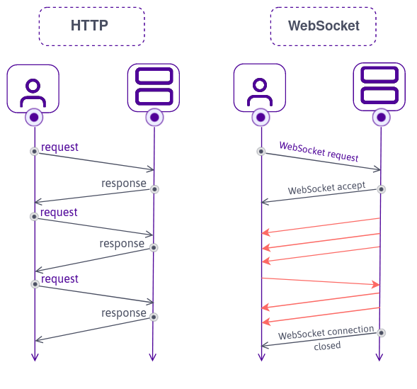

# WebSocket VS HTTPS

## 목차
- [1. WebSocket 연결](#1-WebSocket-연결)
  - [연결 절차](#연결-절차)
  - [전송 방식 및 인코딩](#전송-방식-및-인코딩)
  - [특성](#특성)
- [2. HTTP 연결](#2-HTTP-연결)
  - [HTTP 프로토콜 특징](#HTTP-프로토콜-특징)
  - [상태 및 구조](#상태-및-구조)
  - [보안 요소](#보안-요소)
- [3. WebSocket VS HTTP](#3-WebSocket-VS-HTTP)
- [4. 적절한 프로토콜 선택 전략](#4-적절한-프로토콜-선택-전략)
  - [WebSocket 사용 시 고려 사항](#WebSocket-사용-시-고려-사항)
  - [HTTP 사용 시 고려 사항](#HTTP-사용-시-고려-사항)
  - [오류 복원력](#오류-복원력)
- [5. 추가 기술](#5-추가-기술)

## 1. WebSocket

- WebSocket은 클라이언트와 서버 간에 지속적인 전이중 연결을 유지

### 연결 절차

1. 클라이언트가 HTTP 핸드셰이크 요청(`Upgrade: websocket` 헤더 포함)
2. 서버가 `101 Switching Protocols`로 응답
3. TCP 커넥션을 유지하면서 WebSocket으로 프로토콜 전환 완료

### 전송 방식 및 인코딩

- 프레임 기반 전송 : 텍스트, 바이너리 프레임 구분
- RFC 6455에 정의된 프로토콜
- 머리말 최소화 : 헤더 오버헤드가 작아 성능 우수
- Ping/Pong 프레임 : 연결 유지를 위한 헬스체크 기능

### 특성

- 클라이언트/서버 모두 송신자 역할 가능
- 전송 지연 시간 감소 (특히 이벤트 중심 시스템에서 유리)
- 네이티브 TCP 소켓 기반 지속 연결

---

## 2. HTTP 연결

- HTTP는 요청-응답 모델을 따르는 비연결지향 통신 프로토콜

### HTTP 프로토콜 특징

- **버전별 차이점**
    
    - HTTP/1.1 : 커넥션 재사용 가능 (keep-alive)
    - HTTP/2 : 멀티플렉싱, 헤더 압축 (HPACK)
    - HTTP/3 : QUIC 기반 UDP 전송으로 RTT 감소

### 상태 및 구조

- 상태 비저장(stateless) : 각 요청은 독립적
- 캐시 지원 : 서버, CDN, 브라우저 캐시 활용 가능
- 헤더 기반 메타데이터 교환 구조

### 보안 요소

- HTTPS (TLS over TCP)
- HSTS : 강제 암호화 정책 적용 가능

---

## 3. WebSocket VS HTTP

|항목|WebSocket|HTTP|
|---|---|---|
|연결 유형|TCP 장기 연결|TCP 단기 요청-응답|
|프로토콜 레벨|RFC 6455 (Application Layer)|RFC 2616 (HTTP/1.1), RFC 7540 (HTTP/2) 등|
|통신 방향|Full Duplex|Half Duplex|
|전송 단위|Frame 기반 메시지|Request/Response 기반 문서|
|오버헤드|헤더 최소화 (2~14 bytes)|헤더 과다 (수십~수백 bytes)|
|유지 기능|Ping/Pong, 상태 유지 가능|상태 없음, 재연결 필요|
|확장성|연결 수 관리 필요 (예: 클러스터링, 메시지 브로커)|RESTful 방식으로 수평 확장 용이|
|캐싱|불가능 또는 제한적|강력한 캐시 레이어 구성 가능|
|표준 포트|80(ws), 443(wss)|80(http), 443(https)|

---

## 4. 적절한 프로토콜 선택 전략

### WebSocket 사용 시 고려 사항

- 실시간 데이터가 빈번히 발생하는 경우 (예: 채팅, 협업, IoT 센서 스트림)
- 이벤트 기반 비동기 아키텍처를 구성하는 경우
- 연결 지속성과 상태 공유가 필요한 경우
    

### HTTP 사용 시 고려 사항

- 리소스 요청 중심의 CRUD 작업 (REST API)
- 데이터 전송보다 보안, 캐싱, 버전관리 등이 중요한 경우
- 클라이언트/서버 간 결합도가 낮은 경우
    

### 오류 복원력

- WebSocket: 클라이언트 재연결 로직 필요, 서버 장애 시 영향 큼
- HTTP: 표준화된 상태코드 기반 복원력 우수 (e.g. 503 서비스 불가)
    

---

## 5. 추가 기술

- **WebRTC**: P2P 미디어 통신. WebSocket과 상호보완적 사용 가능
- **MQTT**: 경량 퍼블리시/서브스크라이브 기반, IoT에 적합
- **GraphQL Subscriptions**: WebSocket을 활용한 실시간 API 대안
- **SSE (Server-Sent Events)**: 서버→클라이언트 단방향 스트리밍
    